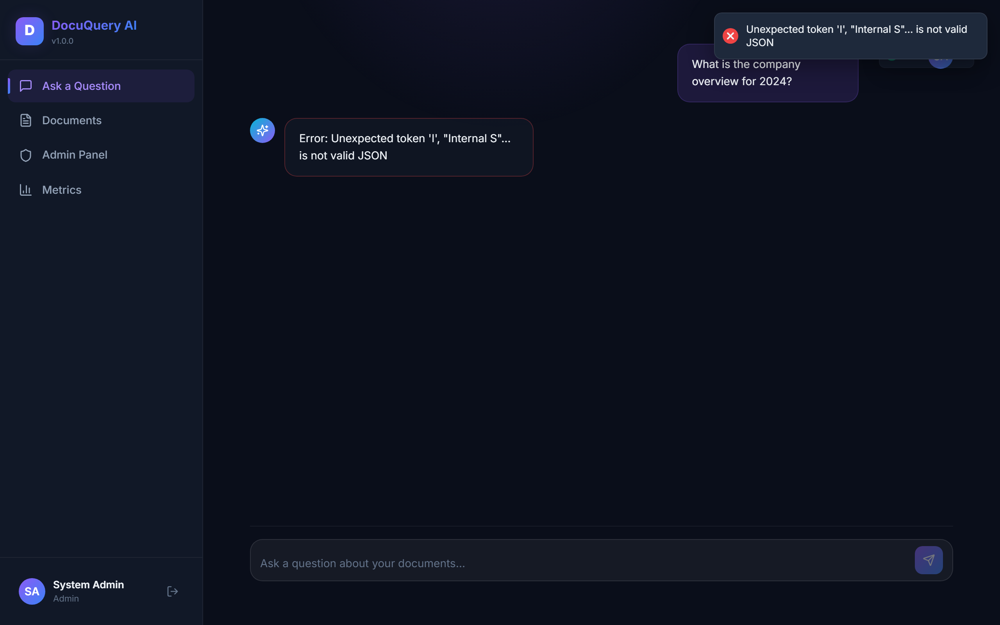
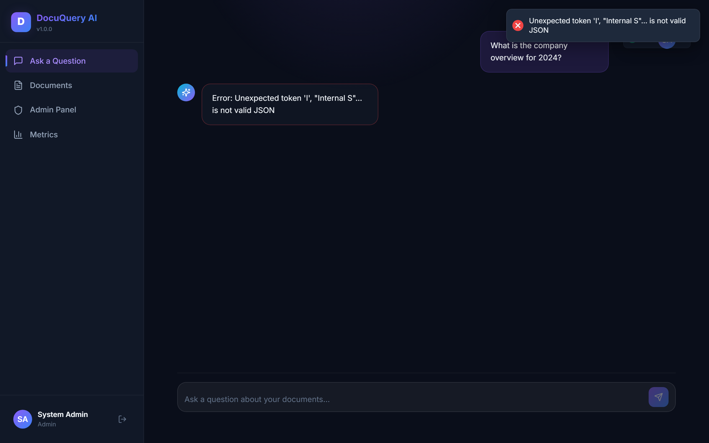
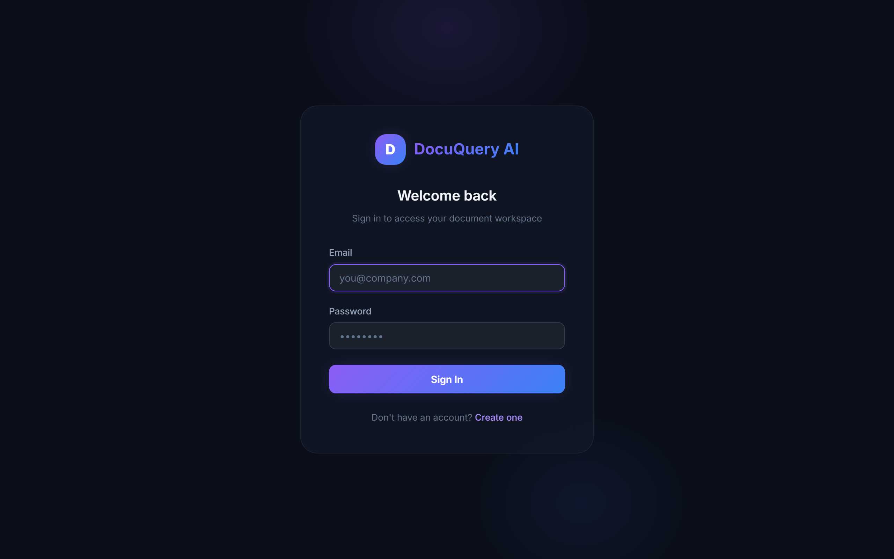
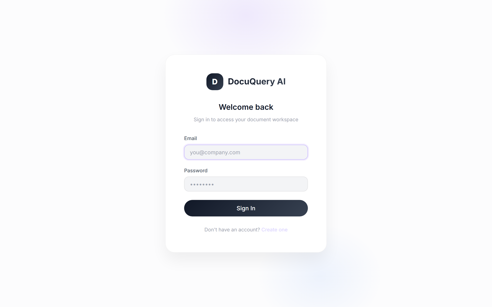
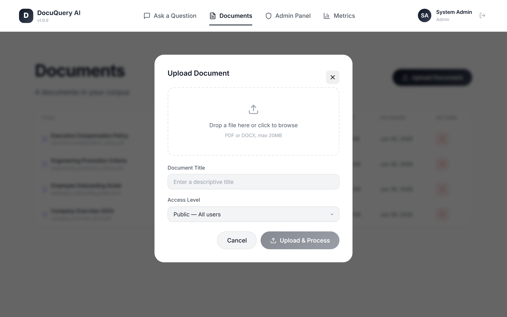
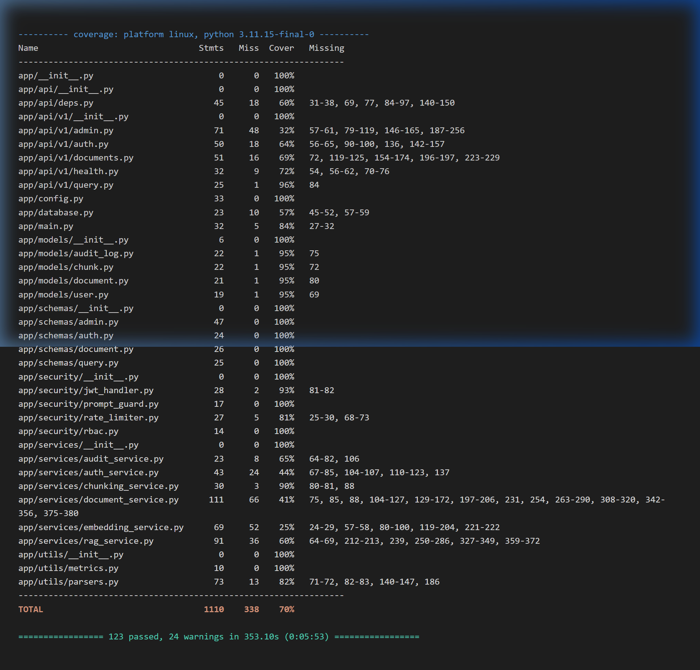

# DocuQuery AI — Intelligent Document Q&A System

> **Production-grade RAG system** with role-based access control, citation-backed answers, and enterprise security features.

[](https://github.com/yourusername/docuquery-ai/actions/workflows/ci.yml)
[](https://www.python.org/downloads/release/python-3110/)
[](https://fastapi.tiangolo.com)
[](https://reactjs.org)
[](https://opensource.org/licenses/MIT)

---

## Overview
## Screenshots

| Login & Authentication | Chat & Citations |
|:---:|:---:|
|  |  |

| Document Management | Admin Dashboard |
|:---:|:---:|
|  |  |

| System Metrics | Test Coverage |
|:---:|:---:|
|  |  |


---

## Architecture

```
┌──────────────────────────────────────────────────────────────────────┐
│                    CLIENT (React 18 + Vite)                          │
│                                                                      │
│   ┌──────────┐ ┌──────────────┐ ┌──────────────┐ ┌───────────────┐  │
│   │ Chat UI  │ │  Document    │ │    Admin     │ │  Auth (Login  │  │
│   │ (Q&A)    │ │  Upload &    │ │  Dashboard   │ │  & Register)  │  │
│   │          │ │  Management  │ │  & Metrics   │ │               │  │
│   └────┬─────┘ └──────┬───────┘ └──────┬───────┘ └───────┬───────┘  │
│        └───────────────┴────────────────┴─────────────────┘          │
└───────────────────────────────────┬──────────────────────────────────┘
                                    │ HTTPS / Nginx Reverse Proxy
                                    ▼
┌──────────────────────────────────────────────────────────────────────┐
│                      API GATEWAY (FastAPI)                           │
│                                                                      │
│   ┌────────────┐  ┌──────────────┐  ┌──────────────────────────┐    │
│   │ JWT Auth   │  │ Rate Limiter │  │ Prompt Injection Guard   │    │
│   │ Middleware │  │ (Redis)      │  │ (Regex-based detection)  │    │
│   └────────────┘  └──────────────┘  └──────────────────────────┘    │
└───────────────────────────────────┬──────────────────────────────────┘
                                    │
                                    ▼
┌──────────────────────────────────────────────────────────────────────┐
│                       CORE SERVICES                                  │
│                                                                      │
│   ┌──────────────┐  ┌──────────────┐  ┌────────────────────────┐    │
│   │  RAG Service  │  │  Document    │  │    Auth Service        │    │
│   │  (Query →     │  │  Service     │  │    (Register, Login,   │    │
│   │   Embed →     │  │  (Parse →    │  │     JWT management)    │    │
│   │   Search →    │  │   Chunk →    │  │                        │    │
│   │   Generate)   │  │   Embed →    │  ├────────────────────────┤    │
│   │              │  │   Store)     │  │    Audit Service       │    │
│   │   RBAC       │  │              │  │    (Query logging,     │    │
│   │   filtering  │  │              │  │     metrics, cost)     │    │
│   │   in SQL     │  │              │  │                        │    │
│   └──────┬───────┘  └──────┬───────┘  └────────────┬───────────┘    │
└──────────┼─────────────────┼───────────────────────┼────────────────┘
           │                 │                       │
           ▼                 ▼                       ▼
┌──────────────────────────────────────────────────────────────────────┐
│                        DATA LAYER                                    │
│                                                                      │
│   ┌──────────────────────────┐    ┌──────────────────────────────┐   │
│   │ PostgreSQL 16 + pgvector │    │  Redis 7                     │   │
│   │                          │    │                              │   │
│   │  • users                 │    │  • Rate limiting counters    │   │
│   │  • documents             │    │  • Session cache             │   │
│   │  • document_chunks       │    │                              │   │
│   │    (Vector(1536) index)  │    │                              │   │
│   │  • audit_logs            │    │                              │   │
│   └──────────────────────────┘    └──────────────────────────────┘   │
└───────────────────────────────────┬──────────────────────────────────┘
                                    │
                                    ▼
┌──────────────────────────────────────────────────────────────────────┐
│                     EXTERNAL SERVICES                                │
│   ┌──────────────────────────────────────────────────────────────┐   │
│   │  OpenAI API                                                  │   │
│   │    • gpt-4o-mini        (response generation)                │   │
│   │    • text-embedding-3-small  (1536-dim embeddings)           │   │
│   └──────────────────────────────────────────────────────────────┘   │
└──────────────────────────────────────────────────────────────────────┘
```

### RBAC Enforcement — How It Works

The critical security property is that RBAC filtering happens **in the SQL WHERE clause**, not in application code:

```sql
SELECT id, document_id, content, token_count,
       1 - (embedding <=> :query_embedding) AS similarity
FROM document_chunks
WHERE access_level = ANY(:allowed_levels)    -- ← RBAC filter in SQL
ORDER BY embedding <=> :query_embedding
LIMIT :top_k
```

This ensures confidential/restricted chunks are **never loaded into memory** for unauthorized users.


---


DocuQuery AI is a retrieval-augmented generation (RAG) system that allows organizations to upload internal documents and ask natural-language questions, receiving accurate, citation-backed answers drawn exclusively from their document corpus. The system enforces **role-based access control (RBAC)** at the retrieval layer, ensuring users only see answers derived from documents they are authorized to access.

### Key Features

- ✅ **Natural Language Q&A** — Ask questions in plain English, get precise answers with source citations
- ✅ **Role-Based Access Control** — Document-level permissions enforced at the vector search layer (admin/manager/employee)
- ✅ **Citation-Backed Answers** — Every claim is attributed to a specific source document
- ✅ **Prompt Injection Guardrails** — Regex-based detection of 13+ attack patterns
- ✅ **Audit Trail** — Every query logged with latency, token usage, and cost tracking
- ✅ **Document Processing Pipeline** — PDF/DOCX parsing → chunking → embedding → vector storage
- ✅ **Admin Dashboard** — User management, audit log viewer, and system metrics with Recharts visualizations
- ✅ **Rate Limiting** — Redis-based sliding window (20 req/min per user)
- ✅ **Health Monitoring** — Simple and detailed health checks for all components
- ✅ **Containerized Deployment** — Docker Compose with PostgreSQL, Redis, and application services
- ✅ **CI/CD Pipeline** — GitHub Actions with backend tests, frontend build verification, and Docker smoke tests

---


## Tech Stack

| Layer | Technology |
|-------|-----------|
| **Frontend** | React 18, Vite, Vanilla CSS (custom design system), React Router v6, Recharts, react-hot-toast |
| **Backend** | Python 3.11, FastAPI, SQLAlchemy (async), Pydantic v2, Alembic |
| **Database** | PostgreSQL 16 + pgvector |
| **Cache** | Redis 7 |
| **LLM** | OpenAI gpt-4o-mini |
| **Embeddings** | OpenAI text-embedding-3-small (1536 dims) |
| **Auth** | JWT (PyJWT) + bcrypt |
| **Containerization** | Docker + Docker Compose |
| **CI/CD** | GitHub Actions |
| **Testing** | pytest + pytest-asyncio + httpx |

---

## Quick Start

### Prerequisites

- Docker and Docker Compose (v2+)
- OpenAI API Key (optional with `--mock-embeddings` flag)

### Setup

```bash
# 1. Clone the repository
git clone https://github.com/yourusername/docuquery-ai.git
cd docuquery-ai

# 2. Configure environment
cp .env.example .env
# Edit .env and set your OPENAI_API_KEY and JWT_SECRET_KEY

# 3. Start all services
docker-compose up --build

# 4. Run database migrations
docker-compose exec backend alembic upgrade head

# 5. Seed demo data (choose one):

# Option A — With real OpenAI embeddings (requires OPENAI_API_KEY):
docker-compose exec backend python -m scripts.seed

# Option B — With mock embeddings (no API key needed):
docker-compose exec backend python -m scripts.seed --mock-embeddings
```

> **Note:** The `--mock-embeddings` flag generates random 1536-dimensional vectors instead of calling the OpenAI API. This lets you explore the full UI and demo the system without an API key. Similarity search results will be random, but all other features (upload, RBAC, audit logging) work normally.

### Access

| Service | URL |
|---------|-----|
| Frontend | http://localhost:5173 |
| Backend API | http://localhost:8000 |
| API Documentation | http://localhost:8000/docs |
| ReDoc | http://localhost:8000/redoc |

### Demo Accounts

| Email | Password | Role | Access Level |
|-------|----------|------|-------------|
| admin@docuquery.ai | password123 | Admin | All documents |
| manager@docuquery.ai | password123 | Manager | Public, internal, confidential |
| employee@docuquery.ai | password123 | Employee | Public, internal only |

---

## Project Structure

```
docuquery-ai/
├── backend/
│   ├── Dockerfile                  # Multi-stage Python build
│   ├── .dockerignore
│   ├── requirements.txt
│   ├── alembic.ini
│   ├── alembic/                    # Database migrations
│   │   ├── env.py
│   │   └── versions/
│   ├── app/
│   │   ├── main.py                 # FastAPI app factory
│   │   ├── config.py               # Pydantic settings
│   │   ├── database.py             # Async SQLAlchemy engine
│   │   ├── models/                 # ORM models
│   │   │   ├── user.py
│   │   │   ├── document.py
│   │   │   ├── chunk.py
│   │   │   └── audit_log.py
│   │   ├── schemas/                # Pydantic request/response schemas
│   │   ├── api/
│   │   │   ├── deps.py             # Auth & DB dependencies
│   │   │   └── v1/                 # Route handlers
│   │   │       ├── auth.py
│   │   │       ├── documents.py
│   │   │       ├── query.py
│   │   │       ├── admin.py
│   │   │       └── health.py
│   │   ├── services/               # Business logic
│   │   │   ├── auth_service.py
│   │   │   ├── document_service.py
│   │   │   ├── rag_service.py
│   │   │   ├── embedding_service.py
│   │   │   ├── chunking_service.py
│   │   │   └── audit_service.py
│   │   ├── security/               # JWT, RBAC, guards
│   │   │   ├── jwt_handler.py
│   │   │   ├── rbac.py
│   │   │   ├── prompt_guard.py
│   │   │   └── rate_limiter.py
│   │   └── utils/
│   │       ├── parsers.py
│   │       └── metrics.py
│   ├── scripts/
│   │   └── seed.py                 # Database seeding script
│   └── tests/
│       ├── conftest.py
│       ├── test_auth.py
│       ├── test_documents.py
│       ├── test_rag_pipeline.py
│       ├── test_rbac.py
│       └── test_prompt_guard.py
├── frontend/
│   ├── Dockerfile                  # Multi-stage Node → Nginx build
│   ├── .dockerignore
│   ├── nginx.conf                  # SPA routing + API proxy
│   ├── package.json
│   ├── vite.config.js
│   ├── index.html
│   └── src/
│       ├── App.jsx                 # Router with auth guards
│       ├── main.jsx                # Entry point with Toaster
│       ├── index.css               # Design system (dark theme)
│       ├── api/client.js           # API client with JWT handling
│       ├── context/AuthContext.jsx  # Auth state management
│       ├── components/Layout.jsx   # Sidebar + page shell
│       └── pages/
│           ├── LoginPage.jsx
│           ├── RegisterPage.jsx
│           ├── ChatPage.jsx
│           ├── DocumentsPage.jsx
│           ├── AdminPage.jsx
│           └── MetricsPage.jsx
├── docs/
│   └── setup-guide.md
├── .github/workflows/ci.yml       # CI/CD pipeline
├── docker-compose.yml
├── .env.example
└── .gitignore
```

---

## API Documentation

Full interactive API docs are available at `/docs` when the server is running.

### Key Endpoints

| Method | Endpoint | Description | Auth |
|--------|----------|-------------|------|
| POST | `/api/v1/auth/register` | Register new user | Public |
| POST | `/api/v1/auth/login` | Login, receive JWT | Public |
| POST | `/api/v1/auth/refresh` | Refresh JWT token | Public |
| GET | `/api/v1/auth/me` | Get current user profile | Required |
| POST | `/api/v1/documents/upload` | Upload document | Admin |
| GET | `/api/v1/documents` | List documents | Required |
| GET | `/api/v1/documents/{id}` | Document details | Required |
| PATCH | `/api/v1/documents/{id}` | Update access level | Admin |
| DELETE | `/api/v1/documents/{id}` | Delete document | Admin |
| POST | `/api/v1/query` | Submit question, get RAG response | Required |
| GET | `/api/v1/query/history` | User's query history | Required |
| GET | `/api/v1/admin/users` | List all users | Admin |
| PATCH | `/api/v1/admin/users/{id}` | Update user role/status | Admin |
| GET | `/api/v1/admin/audit-logs` | Paginated audit logs | Admin |
| GET | `/api/v1/admin/metrics` | System metrics dashboard | Admin |
| GET | `/api/v1/health` | Health check | Public |
| GET | `/api/v1/health/detailed` | Detailed health check | Public |

---

## Environment Variables

| Variable | Description | Default |
|----------|-------------|---------|
| `DATABASE_URL` | PostgreSQL async connection string | Required |
| `REDIS_URL` | Redis connection string | Required |
| `OPENAI_API_KEY` | OpenAI API key for embeddings & LLM | Required* |
| `JWT_SECRET_KEY` | Secret key for JWT signing | Required |
| `JWT_ALGORITHM` | JWT signing algorithm | `HS256` |
| `JWT_ACCESS_TOKEN_EXPIRE_MINUTES` | Token expiry in minutes | `1440` (24h) |
| `JWT_REFRESH_TOKEN_EXPIRE_DAYS` | Refresh token expiry | `7` |
| `CORS_ORIGINS` | Allowed CORS origins (comma-separated) | `http://localhost:5173` |
| `CHUNK_SIZE` | Token count per chunk | `500` |
| `CHUNK_OVERLAP` | Token overlap between chunks | `50` |
| `EMBEDDING_MODEL` | OpenAI embedding model | `text-embedding-3-small` |
| `EMBEDDING_DIMENSIONS` | Embedding vector dimensions | `1536` |
| `LLM_MODEL` | OpenAI chat model | `gpt-4o-mini` |
| `LLM_TEMPERATURE` | LLM response temperature | `0.1` |
| `LLM_MAX_TOKENS` | Max response tokens | `1000` |
| `MAX_FILE_SIZE_MB` | Maximum upload file size | `20` |
| `RATE_LIMIT_PER_MINUTE` | Max queries per user/minute | `20` |
| `LOG_LEVEL` | Logging level | `INFO` |

*\* Not required if using `--mock-embeddings` flag with the seed script for demo purposes.*

See [.env.example](.env.example) for a complete template.

---

## Seed Data

The project includes a seed script that populates the database with demo users and documents:

```bash
# With real OpenAI embeddings (production-quality search):
python -m scripts.seed

# With mock embeddings (no API key needed, random search results):
python -m scripts.seed --mock-embeddings
```

### Seed Contents

**Users:**
| Email | Role | Password |
|-------|------|----------|
| admin@docuquery.ai | Admin | password123 |
| manager@docuquery.ai | Manager | password123 |
| employee@docuquery.ai | Employee | password123 |

**Documents:**
| Title | Access Level | Description |
|-------|-------------|-------------|
| Company Overview 2024 | Public | Company info, financials, strategy |
| Employee Onboarding Guide | Internal | HR onboarding procedures, benefits |
| Engineering Promotion Criteria | Confidential | Leveling, compensation bands, process |
| Executive Compensation Policy | Restricted | Executive salary bands, equity details |

The seed script is **idempotent** — running it multiple times will skip existing records.

---

## Testing

```bash
# Run all tests with coverage
cd backend && pytest --cov=app --cov-report=term-missing -v

# Run specific test suites
pytest tests/test_auth.py -v          # Authentication tests
pytest tests/test_documents.py -v      # Document pipeline tests
pytest tests/test_rbac.py -v           # RBAC enforcement tests (most critical)
pytest tests/test_rag_pipeline.py -v   # RAG pipeline tests
pytest tests/test_prompt_guard.py -v   # Prompt injection detection tests
```

---

## Security Features

- **RBAC at Query Level** — Access filtering in SQL WHERE clause, not application layer
- **Prompt Injection Detection** — 13+ regex patterns for common attack vectors
- **Rate Limiting** — Redis-based sliding window (20 req/min per user)
- **JWT Authentication** — Access + refresh token rotation
- **Password Hashing** — bcrypt via passlib
- **Input Validation** — Pydantic schemas on all endpoints
- **Non-root Containers** — Docker images run as unprivileged user
- **Security Headers** — X-Frame-Options, X-Content-Type-Options, X-XSS-Protection via nginx
- **Route Guards** — Frontend redirects unauthenticated users to /login, non-admins away from /admin

---

## Deployment Guide

### Production Deployment

1. **Set secure environment variables:**
   ```bash
   JWT_SECRET_KEY=$(openssl rand -hex 32)
   OPENAI_API_KEY=sk-your-production-key
   ```

2. **Build and start services:**
   ```bash
   docker-compose up --build -d
   ```

3. **Run migrations:**
   ```bash
   docker-compose exec backend alembic upgrade head
   ```

4. **Seed initial data (optional):**
   ```bash
   docker-compose exec backend python -m scripts.seed
   ```

### Health Checks

All services include health checks:
- **Backend:** `GET /api/v1/health` and `GET /api/v1/health/detailed`
- **Frontend:** nginx responds on port 80
- **Database:** `pg_isready` command
- **Redis:** `redis-cli ping`

Docker Compose monitors these automatically and restarts unhealthy containers.

---


## CI/CD Pipeline

The GitHub Actions CI pipeline runs on every push and pull request:

| Job | Description |
|-----|-------------|
| **Backend Tests** | Runs pytest with PostgreSQL + Redis services, reports coverage |
| **Frontend Check** | Installs dependencies and builds the production bundle |
| **Docker Build** | Smoke test — builds both Docker images to verify Dockerfiles |

---

## License

MIT License — see [LICENSE](LICENSE) for details.
